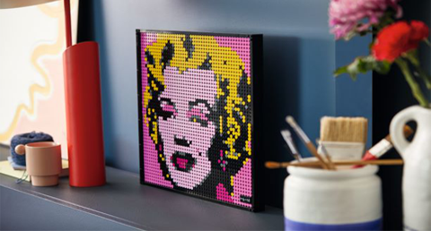

Are you interested to have your own Lego Art? Do you have a face picture?

This tool helps you to do so. Let's see a sample. This is the original image thatis going to become and Lego Art.

using the tool (browse the jpg file, set image size to 64 and the number of colours to 8), the previous image changes to:

The details for buying the legos will be reported, as a sample see here:

[detailed report for buying legos](MarilynMonroe_64_8_Lego_details.rpt)

One real sample:

# How to use the tool

1- Run the exe file (dist/img2lego.exe)
2- browse a jpg file
3- choose the right number of colors and image size
4- press start and see the saved file beside your input image

# run the code

	# Python 3.7 is tested
	pip3 install pillow matplotlib sklearn tornado scikit-learn  
	python3 img2logo.py

# How to generate the exe file

You can use one of these two commands (with/without cmd window):
	
no cmd console for IO:

	pyinstaller --onefile -w --icon=lego.ico  ./img2logo.py --hidden-import sklearn.neighbors.typedefs

with cmd console for IO:

	pyinstaller --onefile --icon=lego.ico  ./img2logo.py --hidden-import sklearn.neighbors.typedefs 

Due to the issue with ''sklearn'' library, we need to modify the ''img2lego.spec'' according to (https://stackoverflow.com/questions/49558126/pyinstaller-and-sklearn-ensemble-modulenotfounderror-no-module-named-sklearn). 

1- add these two lines to the spec file:

	from PyInstaller.utils.hooks import collect_submodules
	hidden_imports = collect_submodules('sklearn')

2- change the hiddenimports from:

	hiddenimports=['sklearn.neighbors.typedefs'],

to:

	-hiddenimports=hidden_imports,

Then regenerate the exe:

	pyinstaller img2lego.spec
